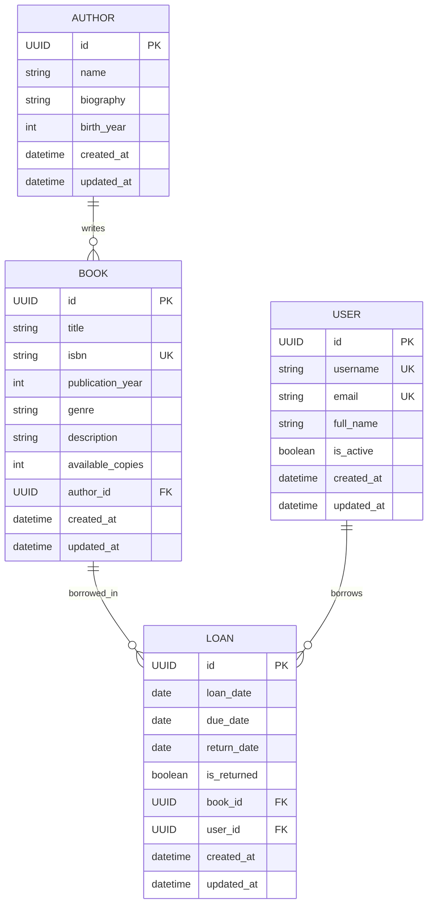

# Database Diagram

The library management system consists of four main entities: Authors, Books, Users, and Loans.

## ER Diagram

## Relationships

1. **Author - Book**: One-to-Many
   - An author can write multiple books
   - Each book has exactly one author

2. **Book - Loan**: One-to-Many
   - A book can be loaned multiple times (sequentially)
   - Each loan refers to exactly one book

3. **User - Loan**: One-to-Many
   - A user can borrow multiple books
   - Each loan is associated with exactly one user

## Business Logic Constraints

1. A book can only be loaned if it has available copies (`available_copies > 0`)
2. When a book is loaned, its `available_copies` is decreased by 1
3. When a book is returned, its `available_copies` is increased by 1
4. A book is considered overdue if:
   - The current date is past the `due_date`
   - The book has not been returned (`is_returned = false`) 