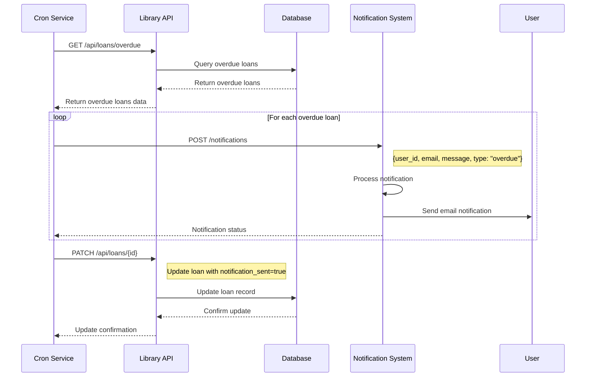

# Integration Diagram

This document outlines a potential integration between our Library API and an external Notification System. This integration would enable automatic notifications for users about overdue books, upcoming due dates, and successful loan/return operations.

## Sequence Diagram: Overdue Book Notification



## Integration Details

### 1. Notification System API Requirements

The external Notification System would need to expose an API endpoint:

```
POST /notifications
```

With the following request body:
```json
{
  "recipient_id": "user-uuid",
  "recipient_email": "user@example.com",
  "subject": "Library Notification",
  "message": "Your book 'Title' is overdue by X days.",
  "notification_type": "overdue|due_soon|confirmation",
  "metadata": {
    "loan_id": "loan-uuid",
    "book_title": "Book Title",
    "due_date": "2025-05-10"
  }
}
```

### 2. Library API Modifications Required

To support this integration, the Library API would need:

1. An additional field in the Loan model:
   ```python
   notification_sent: bool = Field(default=False)
   ```

2. A new endpoint to get loans requiring notification:
   ```
   GET /api/loans/notification-required?type=overdue|due_soon
   ```

3. Scheduled job functionality to periodically check for overdue books

### 3. Authentication Between Systems

Both systems would authenticate using API keys or OAuth2 tokens, with requests containing:

```
Authorization: Bearer <token>
```

### 4. Additional Integration Possibilities

1. **Due Soon Notifications**: Send reminders 2 days before books are due
2. **Loan Confirmation**: Send confirmation when a user borrows a book
3. **Return Confirmation**: Send confirmation when a user returns a book
4. **New Book Notifications**: Alert users when new books by their favorite authors are added 